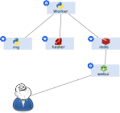

TKS Coins
===

O que isso faz?
---

- É um minerador de "TKSCoins"
- Não dá para comprar nadica de nada com essas moedas;
- Como funciona?
  - Gere um número inteiro aleatório
  - Crie um hash desse número
  - Incremente o contador de hashes encontrados (assim você consegue ver a velocidade de mineração)
  - Continue....
- Tudo isso é didático, isso não é uma criptomoeda. Os únicos pontos em comum são "aleatoriedade", "hash" e "Coins" no nome

Microserviços
---

- rng - gera os números aleatórios
- hasher - web service que gera o hash do número aleatório postado
- worker - faz o trabalho sujo. Chama o rng e o hasher
- webui - interface web, ela tem a barra de progresso. (sim, tem bug no gráfico, ele fica todo serrilhado, lembre-se isso é um exemplo!)
- redis - armazena os contadores

Diagrama de blocos
---

Descoberta dos Serviços
---
Não utilizamos IP's chumbados nas configs, e sim nomes. O Kubernetes tem o serviço de dns integrado com os [services](https://kubernetes.io/docs/concepts/services-networking/service/).

Simplesmente adicione o nome do serviço em sua config que tudo irá funcionar (magicamente).

Expondo o serviço na internet
---
Iremos utilizar o serviço de [ingress](https://kubernetes.io/docs/concepts/services-networking/ingress/). O TKS provisiona automaticamente as entradas de dns e faz a terminação ssl para o usuário.

Kubernetes Manifests
---
Para efetuar o deploy de toda a stack, dê uma olhada no conteúdo da pasta [manifests](manifests/)

Objetivo desse demo
===
Com esses simples aplicativos, conseguimos mostrar como é simples fazer alguns procedimentos como:
- escalar uma aplicação;
- rollouts
- rollbacks

Afinal, o que esperamos?

Esperamos aumentar a performance no gráfico sem trocar uma única linha de código.

E como faremos isso?

Utilizando algumas ferramentas que o kuberntes nos dá mais algumas traquitanas de sysadmin....
